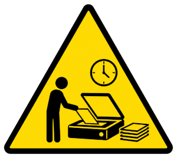

  
**This is active WORK IN PROGRESS (as of 22 Jun 2026).**

# netsettlement

A place for bits of history from when the net was still getting settled. 

## Important Notes

### Forking

**Because of complex issues involving intellectual property rights,
I strongly request that you do _not_ fork this repository.**

### Cloning

If you're disk-space sensitive, I recommend browsing on the Github
site rather than cloning the repo. It's not huge yet, but it might be
once done.  You might resent the disk space and only want individual
files, if any.  There is no intended prohibition on cloning, only
forking. It's just a courtesy to you that I mention the size
issue. Use your own judgment on that.

If you do take individual files, consider taking their sidecar files
as well. Or at least reading them. They may contain important
technical or legal or contextual information. Make sure you have read
this `README.md` document in full as well, for the same reasons.

## About Kent's Archiving Project

Moving to a new home, I found I did not have storage space for
many old manuals, documents, and other records of past times.
I've had to send a lot of it to recycle.

But I tried to check whether many things that might be of historical
interest were properly archived at [The Internet Archive](https://archive.org),
[MIT's DSpace](https://dspace.mit.edu), or other such places. Where I was
unsure, I did what scanning I could afford the time and money to do,
and this repo contains some of the fruits of that.

## Note about Repository Size

This repository contains scanned archival artifacts, including PDFs
(that may in a few cases be tens of megabytes) and some photographs in
various image file formats.  The total number of artifacts is expected
to grow over time, so even though it is starting small, please do not
assume it will continue to be.

If you only need a particular artifact, consider downloading that file
and its associated sidecar files directly rather than cloning the
entire repository.

## Copyrights

Time constraints made it difficult to contact all potential copyright
holders. In the interest of history, I erred on the side of preservation.
But, in general, copyrights belong to the respective content creators.
My placement of documents here is not intended to override that.

Rather, for the sake of history, I'm relying on my lay understanding of
[fair use](https://www.copyright.gov/fair-use/), which
does not seem to offer definitive guidance, so I've made what I hope
are some reasonable assumptions.

* Purpose. This is not a profit-making activity. I'm not charging money
  for the items I'm placing here.

* Nature. These works are generally several decades old, and while there
  is no way to know for sure, as I think of possible uses of this
  personally, I can mostly think of academic uses, not commercial ones.
  
* Amount &amp; Substantiality. I'm hoping this is not relevant to my
  project here. It's not like I'm writing a paper and needing a quote,
  nor am I writing a novel and copying the body of someone else's writing
  in order to save myself the effort of writing a better document. Rather,
  these are pieces of history and their value is in their completeness
  and faithfulness to the original.

* Effect on Potential Market or Value. This seems hard for me or anyone
  to judge in isolation, but if I've put something up here at all, it
  means I don't think it's likely to make a dent in someone's business.
  
  **If you think you are the rightful holder of copyright on
  any of this material and want me to clarify metadata, remove it,
  or otherwise establish an appropriate disposition, feel free to 
  [contact me](https://nhplace.com/kent/contact-kent.html).**

## Licenses

Because of the nature of these materials, I cannot offer any specific
license for content that I did not personally create. You're kind of
on your own about that. In many cases, the reason things are here is that
I don't have ready certainty about the identity of the rightful
intellectual property holders or about how I might contact them.
But there may be other reasons as well,
including the overwhelming truth that I just don't have infinite time
for this very complicated task that no one has paid me to do.
If you need help with that, please don't
expect there's a lot I can do, or that I can comply on any particular timeline,
but with those caveats, you're welcome to
[contact me](https://nhplace.com/kent/contact-kent.html).

## Metadata Files and Annotation Conventions

Even historical preservation is a part of life and has its own organic,
evolving, and sometimes idiosyncratic processes that sometimes have
to be understood. Hopefully the information in this section will help.

As part of placing the artifact in this repository, metadata may (or
may not) have been added in several specific ways. Additional metadata
might evolve over time. I'm going to try to hold the artifact files
constant.

### `.metadata.txt` files

Any artifact file _X_ in this repository might have a sidecar file
named _X_`.metadata.txt` that contains free-form notes added at a more
recent time to put the artifact into historical context. These are
almost always something written at the time of constructing this
repository in the year 2026 or later, and since it's a repository
of things I've collected, the notes are almost always by me 
(Kent M. Pitman), so the git history and date of any such file is
going to tell you most of what you need to know, even though in most
cases I have textually signed and dated the comment within the file
as well.

### `.manifest.txt` files

These files could have been part of the `metadata.txt` files, but in some
cases separating this info out seemed useful. Where they exist, they 
contain an accounting of what files exist in a bundle, that is, when
the pdf is acting as a kind of poor man's `.tar` or `.zip` file.

### `.photo.`_id_`.`_date_`.jpg` files (and similar image formats)

An original physical artifact that a file _X_ was created from might
have been photographed for the historical record. For example, a
hypothetical artifact `foo` that was scanned to create a `foo.pdf`
might have a `foo.pdf.photo.1.2026-01-01.jpg` associated with it that
contains a photo of the (hypothetical) physical artifact we're here
calling `foo`.

The _id_ is usually a number in case there are more than one such
photos, which occasionally happened. But don't assume it is strictly a
number, or that all numbers starting with 1 are supposed to be
there. Sometimes there are tokens like "1a" for variations on a photo
due to cropping or scaling, as an example. Other times there were just
several similar photos 1, 2, and 3 I was deciding between and I may
not have picked any of those ids. No precise semantics is claimed.
It's just an extra id token to help keep things straight where the
other parts of the name would otherwise collide.

There might also be similar files with other image formats, such as
`.gif`, `.png`, `.tiff`, etc.  If you're searching for files of this
kind, probably `*.photo.*` or `*.pdf.photo.*` is the right kind of
wildcard name to look for.

### `.license.txt` files
   
If an artifact file _X_ has a license or permission statement manifest,
there may be a sidecar file for _X_ named _X_`.license.txt` that contains
a faithfully reproduced copy of that license or permission statement,
possibly introduced by an explanatory preamble.

Please note that this is NOT related to an _X_`.license` file described
in [the REUSE specification](https://reuse.software/spec-3.3/).

If a preamble occurs in a `.license.txt` file, it will be separated from
the historical license or permission statement by a text line
containing only `EQUALS SIGN` (`=`) characters. Text up to and including
that line, plus any blank line(s) immediately following, is NOT part
of the historical statement.

### `LICENSES/LicenseRef-` files

For any file _X_ with a corresponding _X_`.license.txt`, there should
also be a corresponding `LicenseRef-`_xxx_ file in the `LICENSES/`
subdirectory of this repository's root, as described
in
[the REUSE specification](https://reuse.software/spec-3.3/#license-files).
My typical practice has been to tidy up this version of the license
by removing textual elements in the historical notice that seemed to me
to be unrelated to the license itself. If in doubt, look for the
`.license.txt` file to confirm for
yourself that the appropriate semantic information has been preserved.

Note that although we show `LICENSES/` here as a relative reference,
there is only one such directory, and it is relative to the repository root.
There are no `LICENSES/` subdirectories elsewhere in this repository.

### Sticky Notes and Metadata Insert Pages

"Well", I can hear you say, "these are scans. Sticky notes cannot be
attached to electronic data." So you might think.

A lot of this project was catalyzed, and the timing and speed was
forced, by external pressures related to the size of a new space I was
moving into, as well as specific policies about storage. Some things
were at risk of going immediately to landfill for want of a better
place to send them, and in a few cases I saved only part of
documents. In other cases, I had not yet evolved a better way of
annotating. Plus I did not initially have a scanner with an automatic
document feeder, so the work was going slowly.

And, so, for some artifacts, I attached yellow sticky notes to
physical pages of some documents prior to scanning in order to either 
add historical context or to note that I had elided the artifact,
saving only certain key pages, since I did not have the time or 
space to save the entire document. In some cases, too, it was expedient
just to add an explanatory page at the beginning of the scan because
at the time I had not yet evolved the idea that there might be a
companion 'sidecar' file that could contain such data. Those situations
might get later repaired, since the scanned PDF can be pried apart and the
metadata page could be peeled out and separated. But the plan is not to do
that kind of thing until after things are in source control so that the
doing of it is tracked.

These documents did not immediately get checked into git. As they are,
I'll attempt to note the fact of the convention in a `.metadata.txt`
file, but there could be places where I overlook that, so please
report discrepancies where it seems like I didn't, and I'll try to fix
that.

## Notes about Scanned Files (PDFs)

The scan dates are recent but the filenames are old. Do not rely on the file dates
in the git repository. The scanned files contain date information, but sometimes it
is easier to find in `.metadata.txt` or `.manifest.txt` files where they exist.

As of the initial creation of this repo, no OCR work has been done. My scanner does
not do it automatically, so these are just images of pages for now.

I have mostly scanned things at [300 DPI](https://en.wikipedia.org/wiki/Dots_per_inch)
since I think that was the maximum
print quality of most things from the era these come from.

In a few cases, I went to 600 DPI, and for such artifacts there may be
`.300dpi` or `.600dpi` markers in the filename to clarify.

Some marketing materials were plainly a lot higher quality color images, but
in most cases it was not my goal to preserve the print quality, only the
fact of the content. Some of those I've set aside as a bundle to see if any
computer history museums want them, but my experience has been that they are
disinterested in content that someone hasn't packaged for them just right.
I have so many gripes about the way these organizations mediate contributions,
but this is not the place. Expect a blog essay sometime on that. But meanwhile
I wanted to save something that was in keeping with an informational record,
so 300 DPI was the thing.

The scan files created by simple-scan on my Ubuntu Linux were far too large,
so I used a bash script that, at its heart, did:

```bash
    gs -sDEVICE=pdfwrite \
       -dCompatibilityLevel=1.4 \
       -dPDFSETTINGS=/ebook \
       -dNOPAUSE -dQUIET -dBATCH \
       -sOutputFile="${tmp_output_file}" \
       "${input_file}"
```

to shrink the scanned files to a more compact size, which is what I've checked in.

The scanner is an old Canon MX310 purchased on Facebook Marketplace. I
had a newer scanner but without an automatic document feeder. I'm
working with very fixed financial limitations, so it was the best I
could, and for all I'm not Facebook's biggest fan, Marketplace is
sometimes a real life-saver for buying usable stuff at an affordable
price. The automatic document feeder put the rescue of many of the
larger documents within reach. Otherwise, I'd have just saved the
hardcopy and someone would have one day discarded them without any
understanding of what they were or why they should be saved and scanned,
if they were even still at that point in a condition to do so.

## About REUSE

I don't purport to be compliant with the [REUSE Specification](https://reuse.software/spec-3.3/),
but for now I did try to informally adopt conventions that seemed aligned
with my needs. If you find there is some way that an adjustment would be
helpful to make this repository more useful to you,
feel free to
[contact me](https://nhplace.com/kent/contact-kent.html) about it.

## References

* [Dots Per Inch](https://en.wikipedia.org/wiki/Dots_per_inch) (print/scan/video density/resolution metric)

* [DSpace@MIT](https://dspace.mit.edu) (M.I.T. Libraries | MIT Open Scholarship)

* [Internet Archive](https://archive.org)

* [REUSE Specification](https://reuse.software/spec-3.3/) (version 3.3)

* [U.S. Copyright Office Fair Use Index](https://www.copyright.gov/fair-use/)
